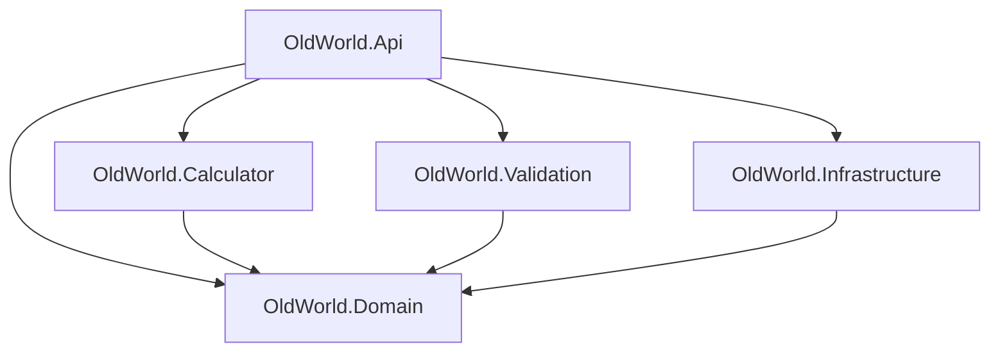

# Old World API

Open [OldWorld.sln](OldWorld.sln). Project folders, assembly names, and namespaces use the `OldWorld.*` names below.

## Projects

| Project | Purpose |
| --- | --- |
| [OldWorld.Domain](OldWorld.Domain) | Game, army, model, equipment, spell, and rule types. Catalog contracts and storage interfaces; no dependencies on other projects. |
| [OldWorld.Calculator](OldWorld.Calculator) | Fractions, probability results, and hit/wound/save calculations. Version-specific calculations live under `Versions/OldWorldV152Renegade`; future versions belong in this same project. |
| [OldWorld.Validation](OldWorld.Validation) | Army composition, points, and selection validation. Initially empty because there was no army-validation code to migrate. Future versions will live inside this project. |
| [OldWorld.Infrastructure](OldWorld.Infrastructure) | Blob storage, catalog loading/storage, external imports, and telemetry integration. Implements Domain's catalog interfaces. |
| [OldWorld.Api](OldWorld.Api) | HTTP endpoints, request coordination, middleware, host configuration, and service registration. |
| **OldWorld.Engine — deferred** | Future game progression and gameplay rules execution. No project yet; existing placeholders remain in [DeferredEngine](OldWorld.Api/Application/GameRules/DeferredEngine). |

Configuration checks remain with API/Infrastructure, and import-format checks remain with the Infrastructure parser. They are separate from army-building validation.

## Dependencies

Arrows mean **depends on**. Domain has no project or package dependencies. Calculator, Validation, and Infrastructure depend only on Domain.



For example, Domain defines `IGameCatalogStorageService`; Infrastructure implements it with `GameCatalogStorageService` using Blob storage. API connects the implementation at startup.

Low-level Blob interfaces remain inside Infrastructure because they describe storage technology. Domain exposes game/catalog contracts without Azure types.

## Build and test

From this directory, using the .NET 10 SDK:

```powershell
dotnet build OldWorld.sln --configuration Release
dotnet test OldWorld.sln --configuration Release --no-build --no-restore
dotnet run --project OldWorld.Api/OldWorld.Api.csproj
```

Running the API requires the existing Azure storage, Application Insights, and game-catalog settings. Configuration section names and the API's user-secrets ID are unchanged.

| Tests | Coverage |
| --- | --- |
| [OldWorld.Calculator.Tests](OldWorld.Calculator.Tests) | Existing hit/wound probability cases. |
| [OldWorld.Domain.Tests](OldWorld.Domain.Tests) | Game serialization and existing points behavior. |
| [OldWorld.Api.Tests](OldWorld.Api.Tests) | Service wiring, catalog startup/storage, and import response behavior, using in-memory storage. |

**Known baseline failure:** `ChanceToWound_tests.Subtract1Attr_4_4` expects numerator `1`, while the current calculation returns `2`. The full suite remains nonzero because this existing test is intentionally unchanged. See [migration notes](docs/architecture-migration.md) for verification results and existing limitations.

## Next work

Discuss and agree on changes before implementing them. This migration preserves behavior; separating army-book choices, selected army lists, and live game state remains a later design task. Engine implementation is deferred. Database updates remain the user's responsibility.

See the [Game class diagram](docs/Domain/game-class-diagram.md) for the current object model.