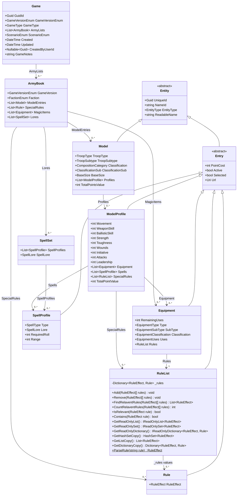
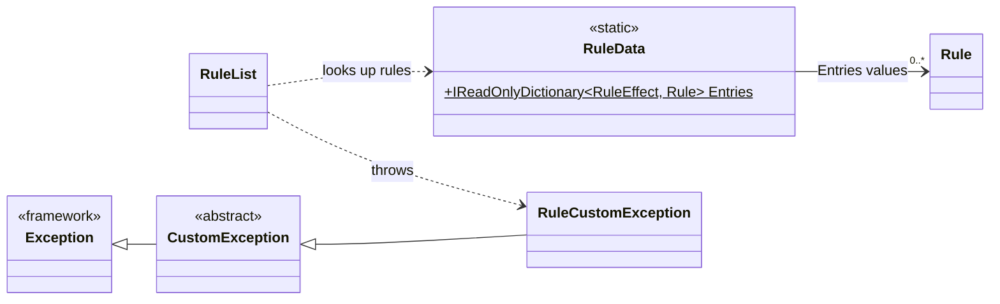

# Game class diagram

This describes the current implementation in `OldWorld.Domain`, starting at `Game` and following its member types recursively, including inherited members and the dependencies used by `RuleList`. It reflects the code, rather than the proposed design in `old-world-general.md`.

## Object model

Solid arrows show references through properties or fields; labels give the member name. `0..*` means a collection, and `1` means a non-nullable reference in the declared model. Hollow triangle arrows point to a base class. References do not imply exclusive ownership: rules can be shared. Enum types appear on properties; framework types such as `Guid`, `DateTime`, `Uri`, and collections are not expanded into separate boxes. Inherited properties are shown only on their declaring base class.

`EntityType` is an abstract getter on `Entity`, overridden by concrete subclasses. `TotalPointsValue` and `TotalPointValue` are computed getters. `RuleList` also provides string overloads of `Add`, `Remove`, `FindRelaventRules`, `CountRelaventRules`, and `Contains`; the spelling of `Relavent` matches the source. The array parameters on the first four methods use `params` in C#.

## Rule lookup dependencies

Dashed arrows show dependencies used by method bodies, rather than stored member references. `RuleData` supplies shared `Rule` instances when `RuleList.Add` succeeds. Invalid names, duplicate additions, missing catalog entries, and unsuccessful removals throw `RuleCustomException`.

## Review notes

- **`Game.ArmyLists` is `List<ArmyBook>`, not `List<ArmyList>`.** `ArmyList` exists but is empty and is not referenced by this object graph.
- **`Unit` and `AdditionalModel` are not reachable from `Game`.** Both inherit `Entity` and reference `Model`, but none of the classes above reference them. `Unit` has a nullable `PrimaryModel` and a `List<Model>` named `AdditionalModels`; that list does not use the `AdditionalModel` class.
- **Points are calculated at the profile and model levels.** `ModelProfile.TotalPointValue` adds its own `PointCost`, equipment costs, and the costs of its `RuleList` objects. It does not include spell costs or sum the individual rules inside those lists. `Model.TotalPointsValue` sums its profile totals. `Game` and `ArmyBook` have no points total.
- **Rule relevance is mutable shared state.** `RuleList.IsRelevant` requires both `Active` and `Selected` on a stored rule. `Add` stores the catalog instance without cloning it, so multiple lists can refer to the same rule.
- **User linkage is an ID only.** `CreatedByUserId` is a nullable `Guid`; there is no user object reference on `Game`.

## Source map

Paths below are relative to this document. Most model classes use the `OldWorld.Domain.Models` namespace; `ModelProfile` uses `OldWorld.Domain.Models.Profile`.

| Area | Source |
| --- | --- |
| Game and army catalog | [Game.cs](../../OldWorld.Domain/Models/Game.cs), [ArmyBook.cs](../../OldWorld.Domain/Models/ArmyBook.cs) |
| Base classes | [Entity.cs](../../OldWorld.Domain/Models/Entity.cs), [Entry.cs](../../OldWorld.Domain/Models/Entry.cs) |
| Models and profiles | [Model.cs](../../OldWorld.Domain/Models/Model.cs), [ModelProfile.cs](../../OldWorld.Domain/Models/Profile/ModelProfile.cs) |
| Equipment and rules | [Equipment.cs](../../OldWorld.Domain/Models/Equipment.cs), [Rule.cs](../../OldWorld.Domain/Models/Rule.cs), [RuleList.cs](../../OldWorld.Domain/DataStructures/RuleList.cs) |
| Spells | [SpellSet.cs](../../OldWorld.Domain/Models/SpellSet.cs), [SpellProfile.cs](../../OldWorld.Domain/Models/SpellProfile.cs) |
| Rule lookup and exceptions | [RuleData.cs](../../OldWorld.Domain/Data/Rules/RuleData.cs), [RuleCustomException.cs](../../OldWorld.Domain/CustomExceptions/RuleCustomException.cs), [CustomException.cs](../../OldWorld.Domain/CustomExceptions/CustomException.cs) |
| Related classes outside the graph | [ArmyList.cs](../../OldWorld.Domain/Models/ArmyList.cs), [Unit.cs](../../OldWorld.Domain/Models/Unit.cs), [AdditionalModel.cs](../../OldWorld.Domain/Models/AdditionalModel.cs) |
| Enum definitions | [Enums directory](../../OldWorld.Domain/Enums) |
